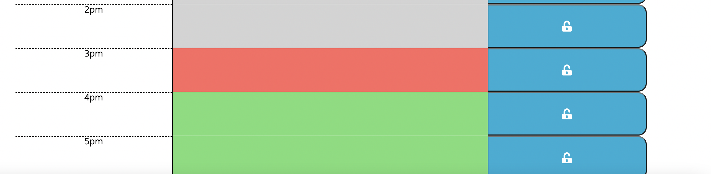
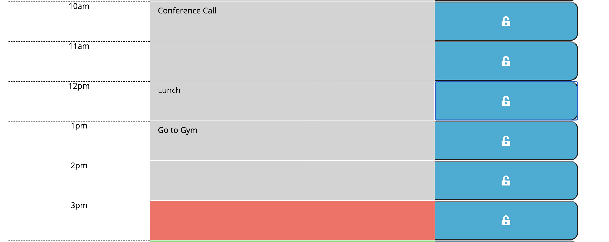

# interactive-daily-planner

This program allows you to organise your work day and keep track of your tasks. Save each new item to its time-slot. The task will turn red when it is currently that time-slot, past events are coloured grey and future events, green, so you can easily keep track of the tasks for the day. The schedule resets each day so you can start all over again!

Technologies:
HTML
JavaScript 
Local Storage to save tasks, at the end of each day the storage is cleared

URL:
https://madsterest.github.io/interactive-daily-planner/

Contact me for any questions or concerns:
Email: odea.madeleine@gmail.com

